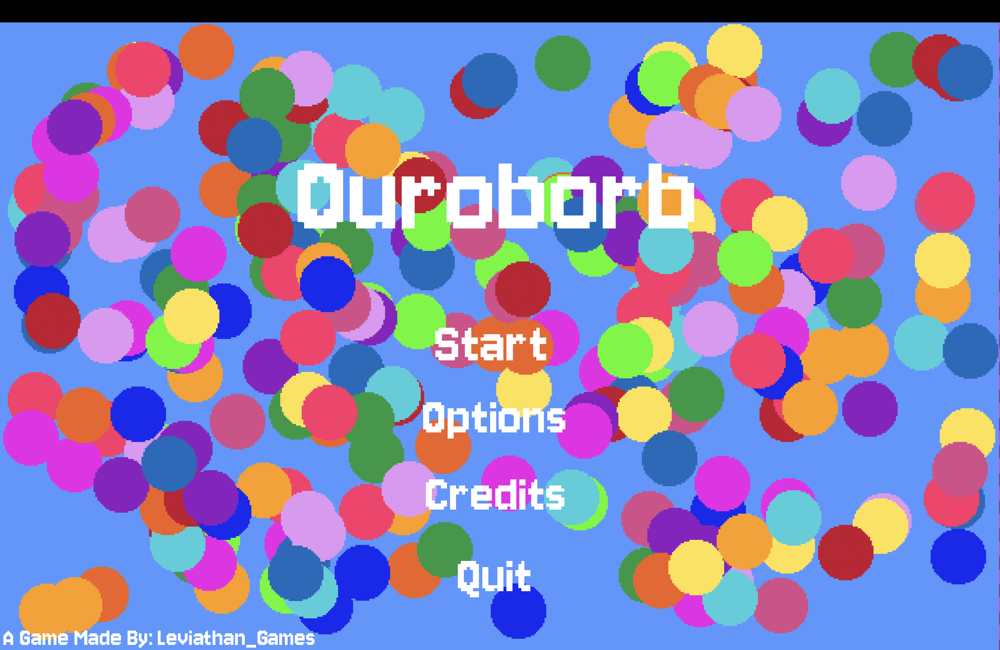
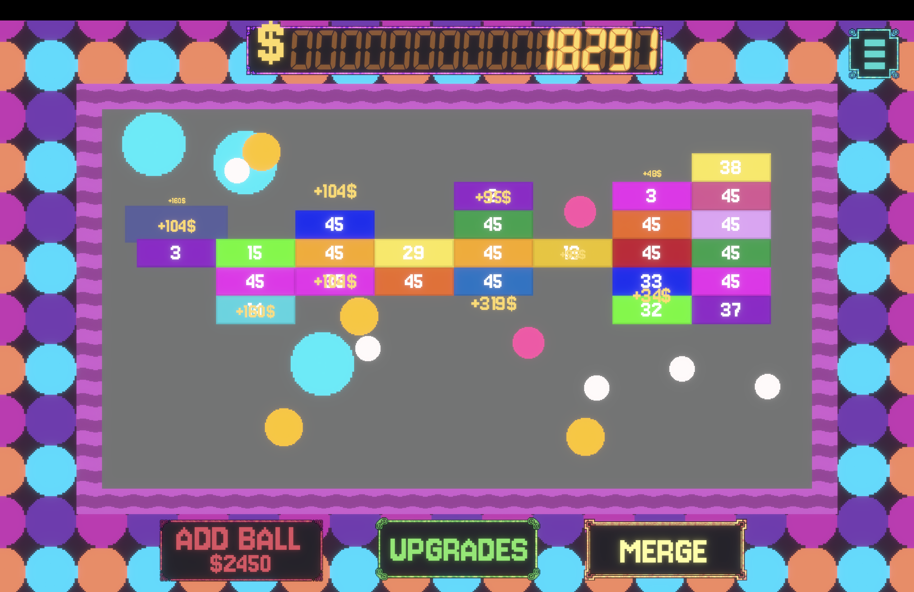

# Ouroborb
- Created for Macondo Hack Club

Full Game: https://levithangamez.itch.io/ouroborb

---

Description:
A 2D incremental video game about upgrading and merging bouncing balls to break tiles as fast as possible, then earning more money and increasing exponentially. Combine balls to explore unique upgrades and more powerful abilities to build an unstoppable ball army. Progress through three unique areas, unlocking new rewards, more balls, and increasingly chaotic gameplay.

Gameplay:
Your goal is to collect every upgrade and max out the skill tree! Grow your economy by clicking, buying upgrades, adding new balls, and merging them into increasingly powerful versions to earn massive amounts of money.

Controls:
- Click to interact

Balls:
- White Ball: Nothing (Default)
- Purple ball: High Crit Chance
- Golden Ball: High Money Value
- Cyan Ball: Bigger Size
- Purple Ball: Excels in Everything

Features:
- Upgrading and merging systems
- Extensive skill tree with pletniful of upgrades
- Responsive visual and audio feedback
- Smooth animations and polished UI

