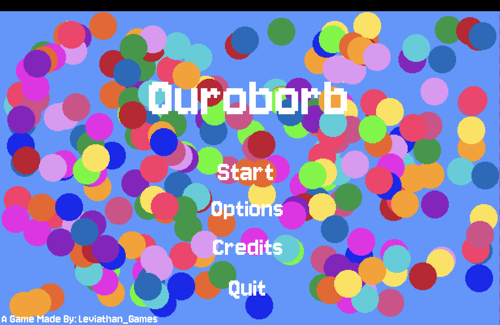
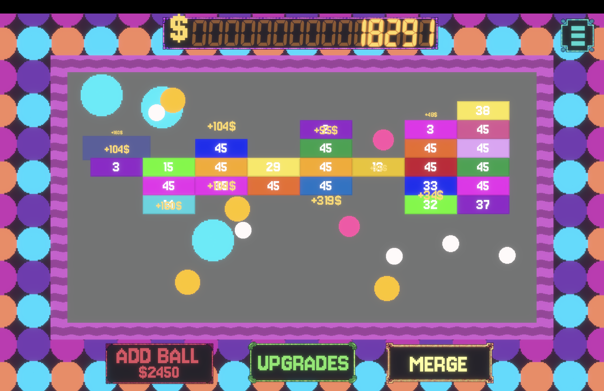

# Ouroborb
- Created for Macondo Hack Club

Full Game: https://levithangamez.itch.io/ouroborb

---

Description:
A 2D incremental video game about upgrading and merging bouncing balls to break tiles as fast as possible, then earning more money and increasing exponentially. Combine balls to make them stronger and grow you ball army and upgrade them to unleash mayhem! 

Gameplay:
Your goal is to collect every upgrade and max out the skill tree! Grow your economy by clicking, buying upgrades, adding new balls, and merging them into increasingly powerful versions to earn massive amounts of money.

Controls:
- Click to interact
- Space for Upgrade Menu
- Esc for pause

Balls:
- White Ball: Nothing (Default)
- Purple ball: High Crit Chance
- Golden Ball: High Money Value
- Cyan Ball: Bigger Size
- Purple Ball: Excels in Everything

Features:
- Upgrading and merging systems
- Extensive skill tree with pletniful of upgrades
- Responsive visual and audio feedback
- Smooth animations and polished UI

Credits:
- Sprite Borders: Border and Panels Menu Part 1
Author: BDragon1727
- Sprite Icons: Ability Icons 16x16
Author: jfranciPX
- Music: Chill
Author: alex-morgan

Steps to run locally:
1. Download Godot Latest Version
2. Clone repository with Github or Github Desktop
3. Open Godot Project Manager and click Import
4. Click on the project.godot file and click open
